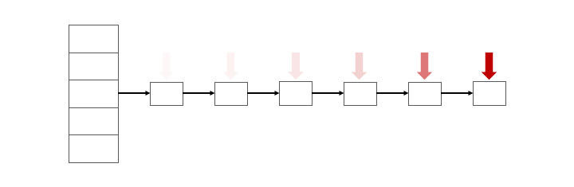
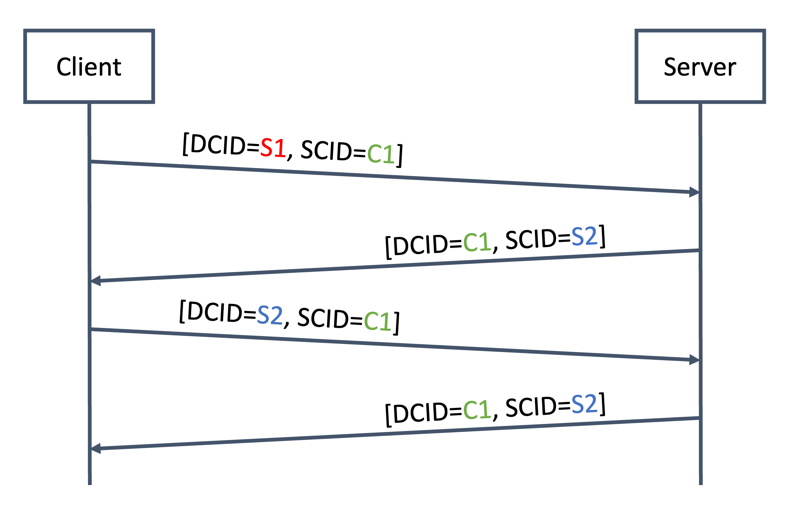

# Technical Advisory – Hash Denial-of-Service Attack in Multiple QUIC Implementations

This technical advisory describes a class of vulnerabilities affecting several QUIC implementations. We first confirmed the presence of this vulnerability in xquic, Alibaba's implementation of the QUIC protocol in late 2024, after which we conducted a thorough review of all open-source QUIC implementations and identified several other vulnerable libraries. In total, this vulnerability was present in five actively maintained libraries, in the example server of one actively-maintained implementation, in one experimental implementation, and in two unmaintained libraries. These implementations are the following

* [kwik](https://github.com/ptrd/kwik) 0.10.0 and all earlier versions (fixed in 0.10.1), tracked under CVE-2025-23020
* [lsquic](https://github.com/litespeedtech/lsquic/) 4.0.12 and all earlier versions (fixed in 4.2.0), tracked under CVE-2025-24947
* [picoquic](https://github.com/private-octopus/picoquic/) at commit `3827b00` on branch master, dated 2025-01-09 and in all previous versions (fixed at commit `b80fd3f` on branch master, dated 2025-02-18), tracked under CVE-2025-24946
* [xquic](https://github.com/alibaba/xquic) version 1.8.1 and all earlier versions (fixed in 1.8.2)
* [Apache Traffic Server](https://github.com/apache/trafficserver/) 10.0.3 and earlier versions supporting QUIC, and the v9.2.x LTS release train version 9.2.8 and earlier versions supporting QUIC (the support for QUIC being experimental for now, the issue is scheduled to be fixed in a future release)
* [ngtcp2](https://github.com/ngtcp2/ngtcp2) 1.10.0 and all earlier versions (in the example server implementation)
* Ericsson Rask, an experimental, pre-GA (General Availability) MP-QUIC implementation
* quant (unmaintained)
* Pluginized QUIC (unmaintained)

Hash Denial-of-Service (DoS) attacks exploit the algorithmic complexity of hash tables when pushing them to their worst-case complexity. Hash DoS attacks were first reported over 20 years ago by Crosby and Wallach, in the paper [_Denial of Service via Algorithmic Complexity Attacks_](https://www.usenix.org/conference/12th-usenix-security-symposium/denial-service-algorithmic-complexity-attacks), at USENIX 2003. Many programming languages evolved to provide safe data structures mitigating this attack. However, lower-level languages typically do not provide such primitives and require developers to implement their own. This article first discusses Hash DoS attacks, then presents some relevant portions of the QUIC protocol and finally highlights what makes QUIC particularly susceptible to this attack. 

# Background on Hash Tables

Hash DoS attacks are algorithmic attacks on data structures that exploit collisions in weak hash functions, triggering the worst-case performance of hash tables. Before delving into how that can be achieved, let us first refresh some concepts behind hash tables.

A hash table is a data structure mapping keys to values. There are many implementations, and modern programming languages usually provide a default implementation (e.g., Rust's `HashMap`, Golang's `map` or Python's `dict`). A hash table can essentially be pictured as an array of buckets. Upon insertion of a key-value pair, the key is hashed, and the digest is used as insertion index into that array of buckets.

An insertion function may look like the following. In that function, the key is hashed using an arbitrary hash function `H()`, and the output is reduced modulo the length of the array, resulting in the insertion index `index`. That index is then used to insert the key-value pair at the corresponding location in the array.

~~~Python
function insert(key, value):
  index = H(key) % len(array)
  array[index] = (key, value)
~~~

Hash tables are a very desirable data structure in that they advertise constant insertion and lookup times (i.e., $`O(1)`$). 

The animation below shows an example of a hash table implementation. In the example, three key-value pairs are inserted into the hash table, leveraging the sample insertion function above. The first two insertion operations result in different insertion indices (2 and 4, respectively), but the third insertion showcases an interesting edge case; what happens when the computed index corresponds to an array index that already contains an entry? Hash tables have different ways of resolving that issue. One common strategy is to use a linked list: the array supporting the hash table implementation contains the head of the linked list, and if a bucket already contains an entry, the key-value pair is inserted at the tail of the linked list (or, alternatively, at the head of that list in some implementations).

# Hash Denial-of-Service Attacks

As stated above, hash tables offer constant time complexity for insertions and lookups, but when inserting colliding values, the complexity grows to linear (i.e., $`O(n)`$). The picture looks worse if an attacker attempts to insert or fetch _n_ elements into the hash table: the amortized complexity becomes quadratic (i.e., $`O(n^2)`$). This represents a significant slowdown compared to what was expected of this presumed fast data structure, as shown in the illustration below.

Finding colliding inputs to be inserted in a hash table would be difficult if the hash function used to compute the insertion index were a hash function with strong cryptographic properties. However, many implementations use fairly simple hash functions for performance reasons.

The multiplicative hash function provided below (written in Python) is a traditional example of the kind of hash functions used in hash table implementations. It is straightforward to compute large amounts of colliding inputs under this function. A subsequent blog post will discuss the different methods by which large number of collisions can be generated. 

~~~Python
def hash(data):
    hash_value = 0
    
    for char in data:
        hash_value = hash_value * 31 + char

    return hash_value
~~~

Other examples of functions that this review encountered in hash table implementations include the [Fowler/Noll/Vo hash algorithm](https://www.ietf.org/archive/id/draft-eastlake-fnv-21.html), [xxHash](https://github.com/Cyan4973/xxHash) and [SipHash](https://en.wikipedia.org/wiki/SipHash). Out of these functions, only SipHash provides significant security guarantees in this context; crafting collisions for the first two can be done fairly efficiently. 

Since their initial discovery in 2003, large-scale Hash DoS attacks have resurfaced periodically, for example in 2011 when Klink and Wälde presented the talk [_Efficient Denial of Service Attacks on Web Application Platforms_](https://fahrplan.events.ccc.de/congress/2011/Fahrplan/attachments/2007_28C3_Effective_DoS_on_web_application_platforms.pdf) at the 28th Chaos Communication Congress in Berlin, where they showed how several web servers and other web application technologies were vulnerable to hash-based DoS. 

The rest of this post discusses a similar generalized issue in QUIC implementations, which is due, in part, to the handling of QUIC's connection IDs.

# QUIC

QUIC (Quick UDP Internet Connections) is a modern transport protocol originally developed by Google and formalized under [RFC 9000](https://datatracker.ietf.org/doc/html/rfc9000) (as well as [a few other](https://datatracker.ietf.org/doc/html/rfc8999) [supporting](https://datatracker.ietf.org/doc/html/rfc9001) [RFCs](https://datatracker.ietf.org/doc/html/rfc9002)) since 2021. QUIC is the backbone of HTTP/3, the latest version of the HTTP protocol.

QUIC is designed to improve the performance of connection-oriented web applications and to reduce network latency by using UDP (User Datagram Protocol) instead of TCP (Transmission Control Protocol), while also offering strong security guarantees. To do so, QUIC leverages the TLS 1.3 handshake to establish cryptographic material in order to secure connections.

The following diagram (sourced from [Wikipedia](https://en.wikipedia.org/wiki/QUIC#/media/File:Tcp-vs-quic-handshake.svg)) showcases some of the performance improvements obtained by leveraging QUIC compared to the traditional TCP and TLS combination. With the latter, a TCP handshake has to be performed first before the TLS handshake to establish keying material and to start exchanging data securely. QUIC only requires a single round trip while providing equivalent security guarantees.

An additional goal of QUIC is to improve performance during network-switching events. This can happen for example when a user with a mobile device transitions from a cellular network to Wi‑Fi. With TCP, the process consists in timing-out every existing connection and re-establishing them as needed. To mitigate this, QUIC was designed to provide seamless connection migration by using a connection identifier (CID) to uniquely identify the connection to the server. Upon switching networks, the connection can be re-established by sending a packet containing this CID, regardless of any changes in the source IP address.

The QUIC RFC in [Section 5.1. Connection ID](https://datatracker.ietf.org/doc/html/rfc9000#name-connection-id) describes the general high-level usage of connection IDs, while emphasizing their independence and how implementations can choose how they are generated. The following excerpt is directly taken from the RFC.

> Each connection possesses a set of connection identifiers, or connection IDs, each of which can identify the connection. Connection IDs are **independently** selected by endpoints; each endpoint selects the connection IDs that its peer uses.
> 
> The primary function of a connection ID is to ensure that changes in addressing at lower protocol layers (UDP, IP) do not cause packets for a QUIC connection to be delivered to the wrong endpoint. Each endpoint selects connection IDs using an **implementation-specific** (and perhaps deployment-specific) method that will allow packets with that connection ID to be routed back to the endpoint and to be identified by the endpoint upon receipt.  [emphasis added]

A connection is identified by a set of two connection IDs, the Source CID (SCID) and the destination CID (DCID). When a client initiates a connection to a QUIC server, the client picks a Source Connection ID (SCID) and sends it as part of a new connection frame. [Section 7.2](https://datatracker.ietf.org/doc/html/rfc9000#section-7.2) of the QUIC RFC describes this process.

> The client populates the Source Connection ID field with a value of its choosing and sets the Source Connection ID Length field to indicate the length.

The client also populates the Destination Connection ID field with a temporary value, which will be updated to a value set by the server once the first response packet has been received. When exchanging messages, the Server will thus respond to requests by setting the Destination CID field of its packets to the Source CID of the client and the Source CID field of its packet to that newly selected value. For subsequent messages, the Client will use the same values, but reversing the SCID and DCID fields. 

The figure below (similar in spirit to [Figure 7](https://datatracker.ietf.org/doc/html/rfc9000#figure-7) of the RFC) showcases the CID assignment and usage process. In a first step, the client selects a Source Connection ID C1 and sets the Destination Connection ID of the server to S1 (which will be overwritten by the server). After receiving this packet, the server sets the Destination ID to the Source CID of the client (C1), and populates its Source CID with a newly generated value (S2).

Hence, it is fairly natural for servers to keep track of active connections using the original client SCID. Astute readers might already have guessed that many server implementations use hash tables to manage connections, and furthermore that they use the peer SCID as a key to index the connection. As also highlighted above, the initial Source CID selected and sent by the client is implementation-specific and can be set to any value within the allowed QUIC parameters (that is, a value between 8 and 20 bytes of length). Hence, an attacker can freely choose CIDs that collide under the target hash function used by a vulnerable server.

# Hash DoS in QUIC Source Connection IDs Tracking

We reviewed all the open-source QUIC libraries listed under the IETF QUIC Working Group [list of implementations](https://github.com/quicwg/base-drafts/wiki/Implementations) and the majority of them implemented a hash table indexed by the peer SCID to manage connections. Not all of these implementations used weak hash functions allowing attackers to compute easy collisions, but a number of them did. Out of a total of 24 implementations listed, about a third of them were affected by this vulnerability, with varying degrees of exploitability (including 2 libraries that were no longer maintained). Interestingly, but not surprisingly, a majority of the affected libraries were written in C and C++.

By exploiting this vulnerability, an attacker is able to significantly slow down vulnerable servers. Some experimental results obtained with one vulnerable library showed us that the implementation suffered a factor 300 slowdown, when only 10k parallel connections were initiated by malicious clients. The asymmetry in resource costs should be highlighted; malicious clients can induce significant burden with minimal effort, while the server bears the computational load. This vulnerability allows attackers to stall the server by forcing it to spend the majority of its computing power inserting and looking up colliding connection IDs.
# Conclusion

We identified an area of the QUIC transport protocol that was prone to hash denial-of-service attacks; a thorough review of existing open-source QUIC implementations revealed that almost a third of all implementations were vulnerable. The majority of affected implementations were written in lower-level programming languages, and their hash table implementations were optimized for efficiency, and not security. 

Most modern programming languages provide secure implementations of hash tables, and make sure not to use the kind of multiplicative hash functions discussed above. Interestingly, one Rust implementation (which is not generally available and not currently on the working group list of implementations) was also vulnerable; even though the standard [HashMap](https://doc.rust-lang.org/std/collections/struct.HashMap.html) provides resistance against Hash DoS attacks, the developers had chosen to use a [non-default hash table](https://doc.rust-lang.org/stable/nightly-rustc/rustc_data_structures/fx/type.FxHashMap.html) implementation. Showcasing the presence of this vulnerability at scale in a cutting-edge transport protocol such as QUIC serves as a critical reminder of these attacks and will hopefully ensure they are not overlooked in future protocol designs and implementations.

# Acknowledgements

Thank you to Thomas Pornin, Giacomo Pope, Kevin Henry and Gérald Doussot for their detailed review and helpful feedback, as well as Javed Samuel for the continuous support during this research project. Additionally, special thanks to Lucas Pardue, co-chair of the QUIC Working Group, for his assistance during the coordinated disclosure process.

# Disclosure Timeline
* 2024-12-07: Sent email to the xquic team to disclose the vulnerability
* 2025-01-02: Sent email to the lead kwik developer to disclose the vulnerability
* 2025-01-03: Lead kwik developer acknowledged the vulnerability
* 2025-01-03: Sent email to the lead picoquic developer to disclose the vulnerability
* 2025-01-03: Lead picoquic developer acknowledged the vulnerability
* 2025-01-07: Lead picoquic developer suggested contacting QUIC Working Group to coordinate disclosure among vendors
* 2025-01-08: Joined the QUIC Dev Slack
* 2025-01-09: Dedicated channel was created on Slack to discuss details with affected vendors
* 2025-01-10: Confirmation of ngtcp2 vulnerability in the example server implementation
* 2025-01-10: Confirmation that Apache Traffic Server is affected
* 2025-01-13: Confirmation that lsquic is affected
* 2025-01-15: Confirmation that Ericsson Rask is affected
* 2025-02-05: Coordinated disclosure date set to 2025-02-18
